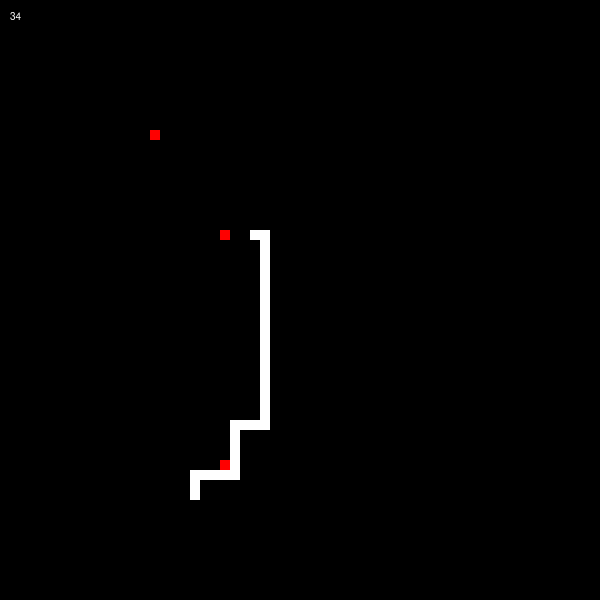

# snake
A very very very basic snake game!!!

I was bored... so I made this bad boy!

  

# Play it yourself
Firt, you'll need to download the code, you can `Download ZIP` or just `git clone` it.
Then just open the `index.html` in your favorite browser!
It should work just right for most browsers, but as I used `ES¨ for some stuff, older browsers may not support it.

# How to play!
Use the `arrows` to move and `p` to pause.

# The code
If you're interested in the code, it's just vanilla javascript. In this project i tried to make everything using mostly ES6 classes and kinda liked the result, it really turned out very clean!
It should be fairly easy to read and understand the code, nothing too complex here.

Anyway, hope you liked it!
